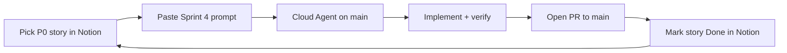

# Cloud Agent + Notion — Sprint 4 backlog workflow

Guide for running [Cursor Cloud Agents](https://cursor.com/agents) against Sprint 4 stories tracked in Notion.

See also: [CURSOR_CLOUD_AGENT.md](./CURSOR_CLOUD_AGENT.md) (GitHub, secrets, branch **`main`**) and [AGENTS.md](../AGENTS.md).

---

## Notion links (Sprint 4)

| Resource | URL |
|----------|-----|
| Product hub | https://app.notion.com/p/385818bdc73d81529bbfdaa17f01cbf1 |
| Stories database | https://app.notion.com/p/76f5b571a6e14f4d8643e3de689d0d1a |
| Sprints / Velocity | https://app.notion.com/p/d1761814f2b2479d8ede05420243f5d6 |
| **Sprint 4 (Export & Classifier)** | https://app.notion.com/p/386818bdc73d8130a540f476e55e34e6 |
| Epic: Compliance Report Export | https://app.notion.com/p/385818bdc73d81d1a11bdae031404a6a |
| Epic: High-Risk & Annex III Classifier | https://app.notion.com/p/385818bdc73d81969d0ae3ffef3acb29 |
| Epic: RFP Response (remaining P0/P1) | https://app.notion.com/p/385818bdc73d81dc8118c97252a5285c |

### Sprint 4 status (June 2026)

- **Sprint 3 done:** Customer-facing assessment mode toggle (RFP mode MVP shipped in repo).
- **Sprint 4 planned:** 86 story points — report export (28), Annex III classifier (32), remaining RFP P0/P1 (26).
- **Recommended build order:** P0 stories first (Markdown export → PDF report → Annex III rules engine → high-risk UI).

---

## Connect Notion MCP to Cloud Agent

Cloud Agents can read acceptance criteria from Notion when the **Notion MCP plugin** is enabled on the agent environment.

### 1 — Enable Notion in Cursor (local IDE, one-time)

1. Open **Cursor Settings → MCP** (or install the **Notion** plugin from the marketplace).
2. Connect your Notion workspace when prompted (OAuth).
3. Confirm the Notion server appears under enabled MCP servers.

### 2 — Enable Notion MCP for Cloud Agents

1. Go to **https://cursor.com/dashboard/cloud-agents**.
2. Open your environment for **`vanithar75/ai-governance-assessor`** (or create one — see [CURSOR_CLOUD_AGENT.md](./CURSOR_CLOUD_AGENT.md)).
3. Under **MCP servers** / **Plugins**, enable **Notion** (plugin id: `notion-workspace`).
4. Authenticate Notion for the cloud environment if prompted (same workspace as the product hub above).
5. Save the environment snapshot.

### 3 — Verify Notion access in a test run

Start a short Cloud Agent run with:

```text
Repository: vanithar75/ai-governance-assessor
Branch: main

Use the Notion MCP to fetch the Stories database schema:
https://app.notion.com/p/76f5b571a6e14f4d8643e3de689d0d1a

List Sprint 4 P0 stories and their acceptance criteria. Do not change code.
```

If the agent returns Sprint 4 story names and criteria, Notion MCP is wired correctly.

### MCP tools the agent should use

| Tool | Purpose |
|------|---------|
| `notion-fetch` | Read a story page or database schema (pass story URL or database URL) |
| `notion-search` | Find stories by keyword within the Stories database |
| `notion-update-page` | Mark story **In Progress** / **Done** after PR merge (optional) |

**Note:** Bulk SQL queries (`notion-query-data-sources`) require Notion Enterprise + AI. Prefer `notion-fetch` on individual story URLs from the prompt below.

---

## Workflow — one story per Cloud Agent run



| Step | Action |
|------|--------|
| 1 | In Notion Stories DB, filter **Sprint = Sprint 4**, sort by **Priority**. |
| 2 | Set the chosen story to **In Progress**. |
| 3 | Paste the [Sprint 4 prompt](#ready-to-paste-sprint-4-prompt) at **https://cursor.com/agents**, replacing `<STORY>` with the exact story title. |
| 4 | Branch: **`main`**. Repository: **`vanithar75/ai-governance-assessor`**. |
| 5 | Agent implements, runs `npm run lint`, `npm run build`, `npm run validate-standards`. |
| 6 | Agent opens **one PR to `main`** per story. |
| 7 | After merge, set story **Done** in Notion; update Sprint 4 **Completed Points**. |

Do **not** batch multiple unrelated stories in one agent run — keeps PRs reviewable and matches velocity tracking.

---

## Ready-to-paste Sprint 4 prompt

Use at **https://cursor.com/agents** or **IDE → Agent → Cloud** with branch **`main`**. Replace `<STORY>` with one story from the list below.

```text
Repository: vanithar75/ai-governance-assessor
Branch: main

Implement ONE Sprint 4 user story: "<STORY>"

Notion (read acceptance criteria via Notion MCP):
- Product hub: https://app.notion.com/p/385818bdc73d81529bbfdaa17f01cbf1
- Stories DB: https://app.notion.com/p/76f5b571a6e14f4d8643e3de689d0d1a
- Sprint 4: https://app.notion.com/p/386818bdc73d8130a540f476e55e34e6

Use notion-fetch on the Stories database, find "<STORY>", and implement exactly its Acceptance Criteria.

Sprint 4 scope (86 pts planned):
- Compliance Report Export (PDF/Markdown) — epic: https://app.notion.com/p/385818bdc73d81d1a11bdae031404a6a
- High-Risk & Annex III Classifier — epic: https://app.notion.com/p/385818bdc73d81969d0ae3ffef3acb29
- Remaining RFP P0/P1 — epic: https://app.notion.com/p/385818bdc73d81dc8118c97252a5285c

Context:
- Sprint 3 RFP customer assessment mode is DONE (customer profile, mode toggle, RFP summary panel).
- Read docs/PHASE1.md, docs/PHASE2.md, AGENTS.md; match patterns in app/ and components/.
- Presales use case: NIST AI RMF, EU AI Act, ISO 42001 assessments for RFP responses.

Deliverables (this run only):
1. Implement "<STORY>" acceptance criteria end-to-end.
2. npm run lint && npm run build && npm run validate-standards
3. Open a single PR to main when done.

Do not commit secrets. Do not implement other Sprint 4 stories in this run.
```

### Sprint 4 story list (build order)

#### P0 — start here

| Story | Pts | Epic | Notion URL |
|-------|-----|------|------------|
| Markdown export for RFP appendices | 5 | Report Export | https://app.notion.com/p/385818bdc73d81ec9644c2d110a73d71 |
| PDF report generation | 8 | Report Export | https://app.notion.com/p/385818bdc73d81b59543edc2e0b16de1 |
| Compliance gap summary section | 5 | Report Export | https://app.notion.com/p/385818bdc73d81ae8541ccf443a33d4b |
| EU AI Act Annex III classifier rules engine | 8 | Classifier | https://app.notion.com/p/385818bdc73d810394ecd24a3083ac2d |
| High-risk use case identification UI | 5 | Classifier | https://app.notion.com/p/385818bdc73d813289c9e6708bf1a607 |
| Risk classification summary report | 8 | Classifier | https://app.notion.com/p/385818bdc73d814b95c4e10fb164aa78 |
| RFP questionnaire templates | 8 | RFP (remaining) | https://app.notion.com/p/385818bdc73d81159cc6e28c3c852905 |
| Assessment sharing via secure link | 8 | RFP (remaining) | https://app.notion.com/p/385818bdc73d81ff9f5bf5d8fba81d3f |

#### P1 — after P0

| Story | Pts | Epic | Notion URL |
|-------|-----|------|------------|
| Framework-specific report templates | 5 | Report Export | https://app.notion.com/p/385818bdc73d818db017c4f134e5a100 |
| Evidence attachment inclusion in export | 5 | Report Export | https://app.notion.com/p/385818bdc73d81d5879ad75e94432fc9 |
| NIST high-risk category mapping | 5 | Classifier | https://app.notion.com/p/385818bdc73d813383a8c4fc31c26802 |
| Customer branding/white-label header | 5 | RFP (remaining) | https://app.notion.com/p/385818bdc73d81618670d99748bf4b02 |
| Presales dashboard view | 5 | RFP (remaining) | https://app.notion.com/p/385818bdc73d813db1edd6f1988a33f4 |

#### P2 — polish

| Story | Pts | Epic | Notion URL |
|-------|-----|------|------------|
| Classifier confidence scoring | 3 | Classifier | https://app.notion.com/p/385818bdc73d818fae7bc4435d0be281 |
| Override/appeal workflow for classification | 3 | Classifier | https://app.notion.com/p/385818bdc73d815ca8a2d7581237cb6d |

### Example — first run

Replace `<STORY>` with **Markdown export for RFP appendices**:

```text
Implement ONE Sprint 4 user story: "Markdown export for RFP appendices"
```

---

## Example follow-up prompts (after first story merges)

**PDF report generation:**

```text
Implement ONE Sprint 4 user story: "PDF report generation"
Story URL: https://app.notion.com/p/385818bdc73d81b59543edc2e0b16de1
(Use full Sprint 4 prompt template above; depend on Markdown export if merged.)
```

**Annex III classifier:**

```text
Implement ONE Sprint 4 user story: "EU AI Act Annex III classifier rules engine"
Story URL: https://app.notion.com/p/385818bdc73d810394ecd24a3083ac2d
```

---

## Verification checklist (every run)

```bash
npm run lint
npm run build
npm run validate-standards
```

Optional: `npm run dev` on port 3000 for UI stories.

---

## Related docs

| Doc | Purpose |
|-----|---------|
| [CURSOR_CLOUD_AGENT.md](./CURSOR_CLOUD_AGENT.md) | GitHub connect, secrets, branch troubleshooting |
| [PHASE1.md](./PHASE1.md) | Assessments, drafts, evidence |
| [PHASE2.md](./PHASE2.md) | Mappings, RAG, curation |
| [DEVELOPMENT_WITHOUT_CLOUD_AGENT.md](./DEVELOPMENT_WITHOUT_CLOUD_AGENT.md) | Local IDE workflow |
